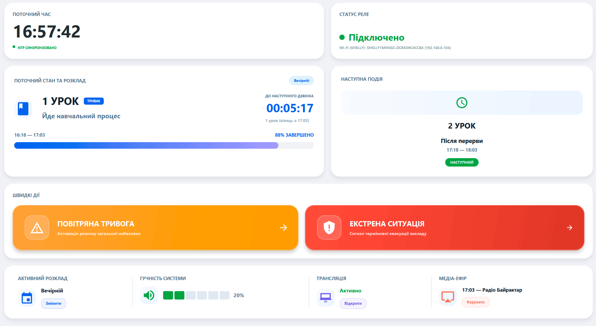
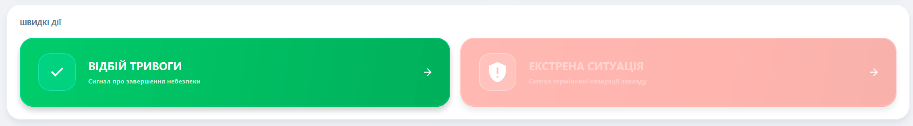
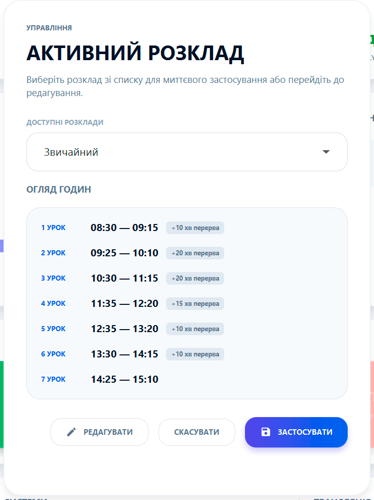
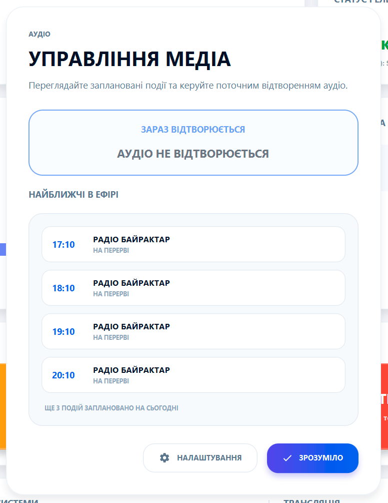

# 🏠 Головна сторінка: Центр керування школою

Ласкаво просимо до вашого цифрового штабу! Головна сторінка спроєктована за принципом **"Premium Floating UI"**, що забезпечує швидкий доступ до критично важливої інформації та миттєве керування системою.

---

### 🕒 Панель статусу та часу
Верхній лівий блок відображає поточний час. Це не просто годинник — він синхронізується з точними серверами часу через інтернет, що гарантує подачу дзвінків секунда в секунду.

### 🔌 Керування реле
Блок **"Статус реле"** — ваш візуальний контроль за фізичним дзвінком. Тут ви бачите, чи підключено ваше обладнання (USB або WiFi Shelly). 
> **💡 Порада:** Якщо індикатор світиться червоним — перевірте живлення реле або налаштування мережі.

### 🔔 Стан дзвінків та розклад
Центральні блоки дозволяють тримати руку на пульсі навчального процесу:
*   **Поточний стан:** Показує, чи триває зараз урок, чи перерва, та веде зворотний відлік часу.
*   **Наступна подія:** Ви завжди знаєте, який урок наступний і коли саме він розпочнеться.

### 🚨 Екстрені дії (Критична безпека)
Блок **"Швидкі дії"** містить дві найважливіші кнопки:
1.  **Повітряна тривога** 🛡️ — негайна подача сигналу тривоги.
2.  **Екстрена ситуація** 🆘 — для непередбачуваних випадків.

**Важливо:** При активації цих сигналів всі планові дзвінки та музика автоматично вимикаються до моменту відбою.

---

### 📅 Керування розкладом
В блоці **"Активний розклад"** ви можете миттєво перемикатися між різними режимами роботи школи (наприклад, "Звичайний", "Скорочений" або "Святковий").
Натисніть **"Змінити"**, щоб відкрити вікно швидкого вибору розкладу.

---

### 🎙️ Медіа та ефір
Ваша школа — це не лише дзвінки, а й інформаційне середовище:
*   **Гучність системи:** Повзунок для оперативного регулювання звуку оголошень та музики.
*   **Трансляція:** Контроль виводу інформації на ТВ-панелі.
*   **Медіаефір:** Міні-плеєр, де можна побачити, що зараз грає, та керувати графіком аудіоподій.

---

### 🚀 Автоматичне оновлення
Програма School Bell постійно вдосконалюється. Коли з'явиться нова версія, ви отримаєте елегантне сповіщення в нижній частині екрана. Процес оновлення повністю автоматизований: один клік — і ви маєте найсвіжіші функції!
