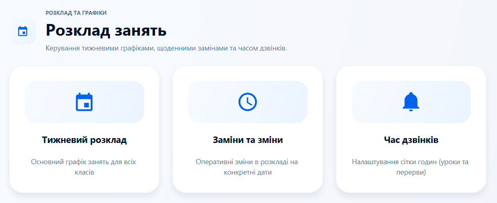
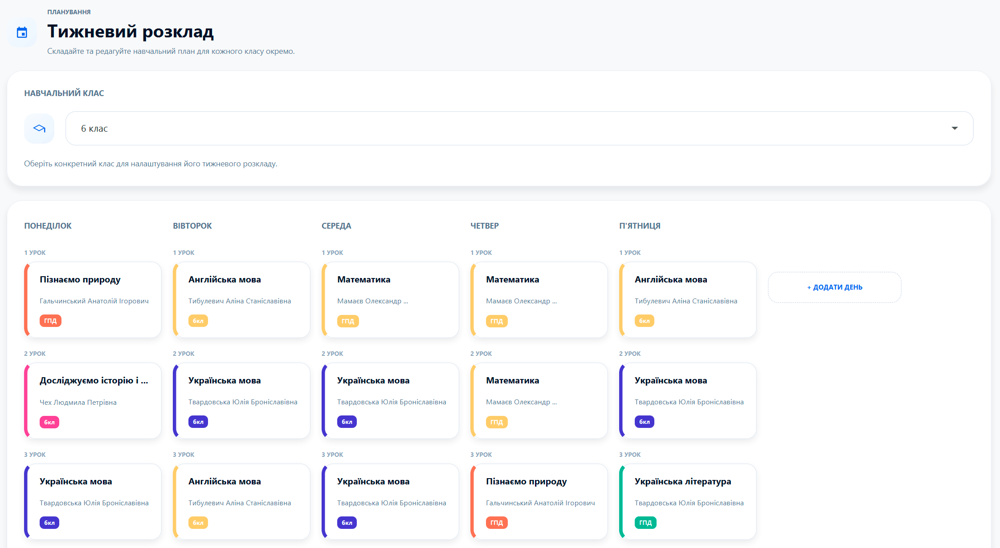
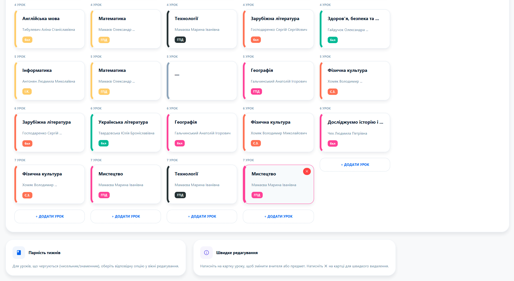
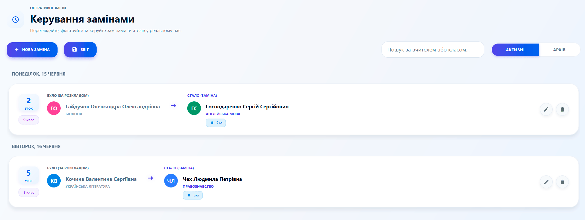
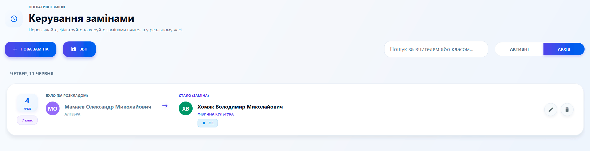
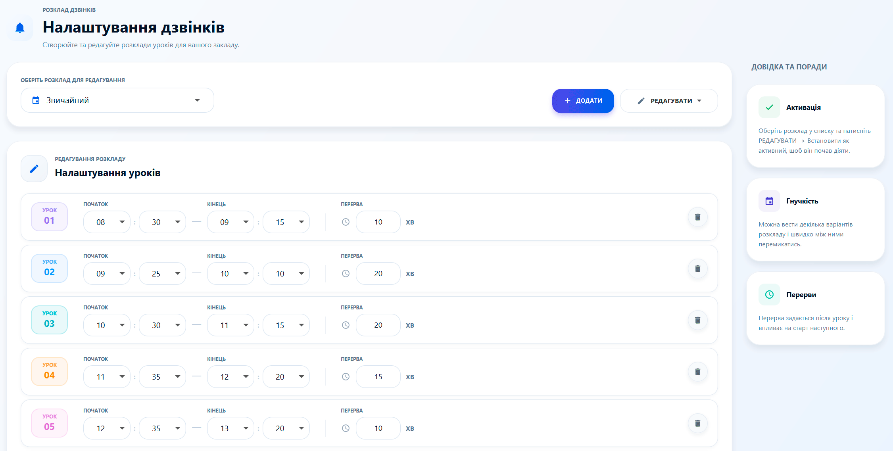
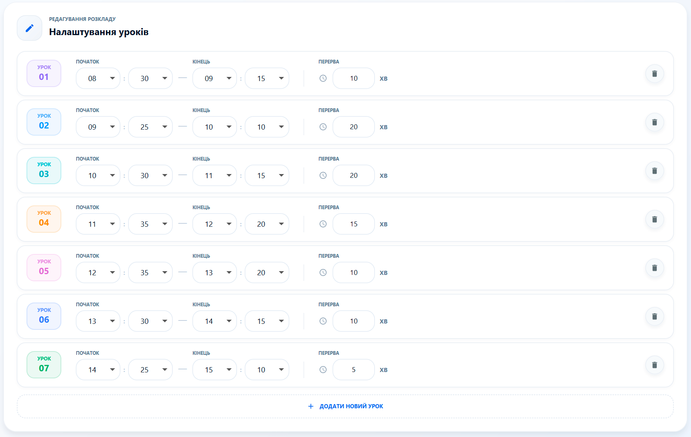
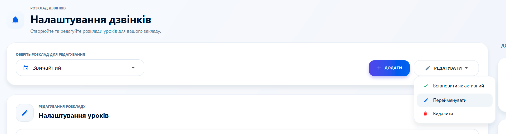

# 📅 Розклад: Серце навчального процесу

Гнучке керування часом — запорука порядку в школі. Розділ "Розклад" дозволяє налаштувати кожен аспект: від хвилин дзвінка до замін вчителів на місяць вперед.

---

### 🧭 Навігація розділу
Меню розкладу розділене на три ключові напрямки:
1. **Тижневий розклад** — що і коли вчать діти.
2. **Заміни та зміни** — оперативне реагування на відсутність вчителів.
3. **Час дзвінків** — часова сітка вашого закладу.

---

### 🏫 Тижневий розклад
Тут ви створюєте візуальну карту занять для кожного класу. 
*   **Карткова система:** Кожен урок — це стильна картка з інформацією про вчителя, предмет та кабінет.
*   **Циклічність:** Підтримка парних та непарних тижнів ("чисельник" та "знаменник").
*   **Швидкі дії:** Наведіть на картку, щоб з'явилася кнопка швидкого видалення. 

> **💡 Порада:** Ви можете додавати уроки навіть на суботу та неділю, якщо школа працює за шестиденним графіком або проводить факультативи.

---

### 🔄 Заміни та зміни
Більше ніяких паперових оголошень про заміни! 
*   **Автоматизація:** Створена заміна автоматично з'являється на ТВ-екранах в холі школи.
*   **Розумні списки:** Вибирайте вчителів та класи з уже готової бази.
*   **Архів:** Система сама піклується про чистоту — старі заміни переносяться в архів і видаляються через 45 днів.

---

### 🔔 Час дзвінків (Сітка)
Це фундамент, на якому тримається автоматизація дзвінків.
*   **Безліч варіантів:** Створюйте окремі розклади для "Звичайного дня", "П'ятниці" чи "Скорочених уроків".
*   **Легке редагування:** Змінюйте тривалість уроків та перерв у декілька кліків.
*   **Активація:** Щоб обраний розклад почав керувати дзвінками, встановіть його як **"Активний"**.

