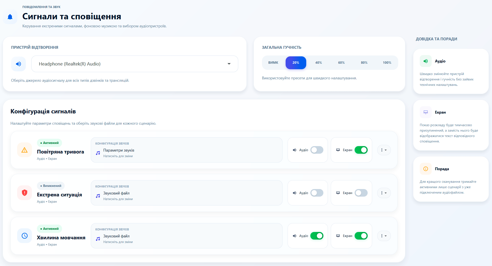
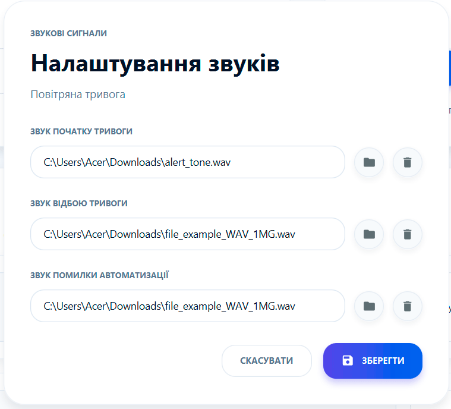
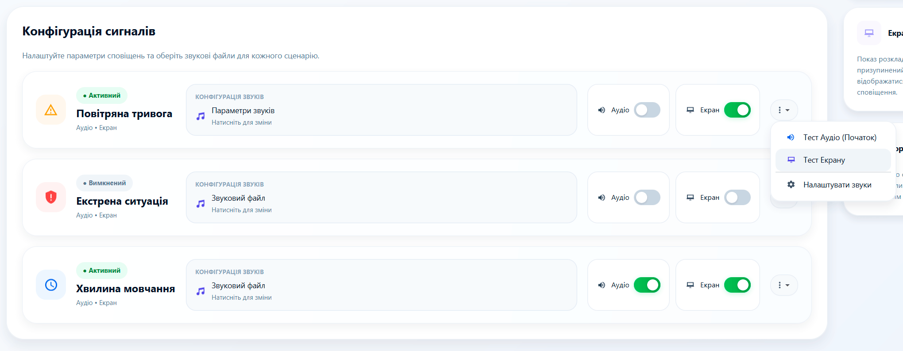
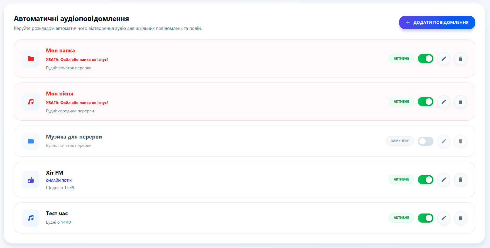
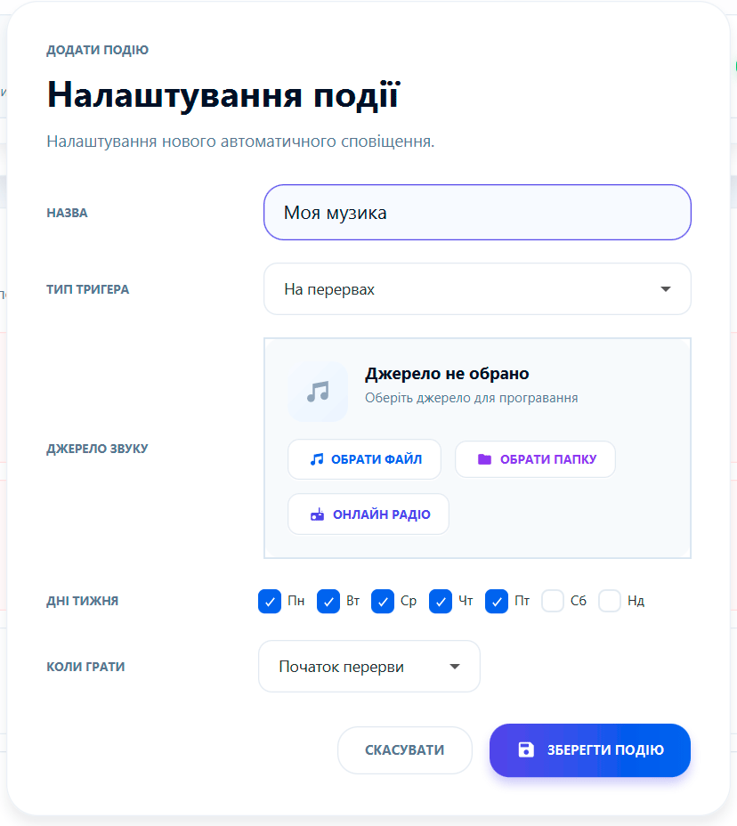
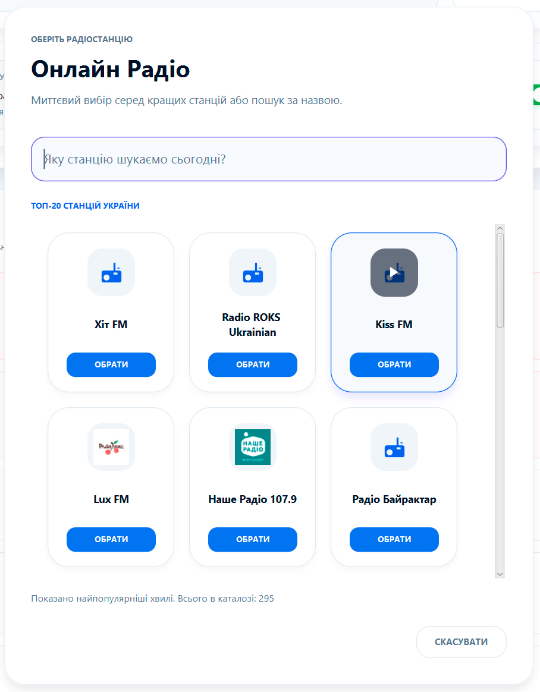

# 📣 Сигнали та сповіщення: Голос вашої школи

Перетворіть звичайний шкільний дзвінок на сучасну аудіосистему. Цей розділ дозволяє керувати всім, що звучить у стінах закладу: від класичного сигналу до онлайн-радіо.

---

### 🎧 Аудіоналаштування
Перш за все, переконайтеся, що система бачить ваші динаміки:
*   **Вибір пристрою:** Виберіть потрібний аудіовихід (наприклад, "Realtek High Definition Audio" або зовнішню USB-карту).
*   **Майстер-гучність:** Швидкі кнопки для перевірки та встановлення комфортного рівня звуку.

---

### 🛡️ Критичні сигнали
Налаштуйте особливі звуки для важливих подій. Програма підтримує:
*   **Повітряна тривога:** Спеціальний звук, що рятує життя.
*   **Надзвичайна ситуація:** Чіткий сигнал для евакуації.
*   **Хвилина мовчання (09:00):** Автоматичне вшанування пам'яті героїв.

**💡 Мультимедійність:** Ви можете не лише подати звук, а й автоматично вивести візуальне попередження на всі ТВ-екрани школи.

---

### 🎵 Автоматичний медіаефір
Створіть унікальну атмосферу на перервах!
*   **Різноманітні джерела:** Використовуйте окремі файли, цілі папки з музикою або прямі трансляції радіо.
*   **Розумний розклад:** Налаштуйте музику так, щоб вона лунала лише на перервах, у конкретні дні тижня або один раз для спеціальної події.
*   **Пріоритет:** Програма автоматично приглушує музику за 10 секунд до дзвінка на урок.

---

### 📻 Онлайн радіо
Інтегрований каталог дозволяє транслювати найкращі українські та світові радіостанції без зайвого обладнання.
*   **Пошук:** Знайдіть свою улюблену станцію за назвою.
*   **Каталог:** Використовується глобальна база Radio Browser API.
*   **Оновлення:** Якщо список порожній — натисніть "Оновити каталог" у системних налаштуваннях.

