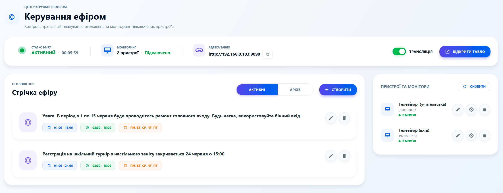
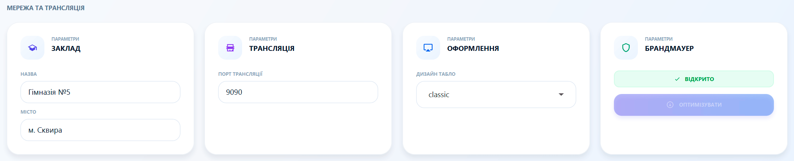

# 📺 Керування ефіром: Шкільне телебачення

Система School Bell дозволяє перетворити будь-який телевізор у школі на інформаційне табло. Транслюйте розклад, заміни та важливі оголошення в режимі реального часу.

---

### 🌐 Як запустити трансляцію?
Процес налаштування максимально простий і не потребує кабелів:
1.  Увімкніть **Головний перемикач** у верхньому правому куті сторінки.
2.  Запишіть **адресу трансляції** (наприклад, `http://192.168.1.10:9090`).
3.  На вашому Smart TV відкрийте браузер і введіть цю адресу.
4.  **Готово!** Тепер телевізор показує актуальне життя школи.

---

### 📝 Стрічка оголошень
Створюйте яскраві текстові повідомлення, які будуть бачити всі:
*   **Гнучкий час:** Вкажіть період показу (наприклад, лише сьогодні з 08:00 до 15:00).
*   **Автоматизація:** Оголошення автоматично зникне з екрана після завершення вказаного терміну.
*   **Архів:** Всі минулі оголошення зберігаються 45 днів для звітності.

---

### 🎨 Дизайн та технічні деталі
Ви можете підлаштувати зовнішній вигляд ефіру під інтер'єр школи:
*   **Оформлення:** Вибирайте один із декількох стильних дизайнів (Classic, Modern, Cyber тощо).
*   **Назва закладу:** Впишіть назву вашої школи, і вона з'явиться у заголовку трансляції.
*   **Брандмауер (Firewall):** Якщо телевізор не бачить комп'ютер, натисніть кнопку **"Оптимізувати"** — система автоматично відкриє необхідні порти в Windows.

---

### 💡 Поради для кращого досвіду:
*   **Режим "Кіоск":** Якщо ваш ТВ підтримує режим киоску або автозапуску браузера, ви можете налаштувати його так, щоб розклад з'являвся відразу після ввімкнення телевізора.
*   **Стабільна мережа:** Для безперебійної трансляції рекомендується підключати комп'ютер та телевізори до однієї мережі через кабель (LAN).
