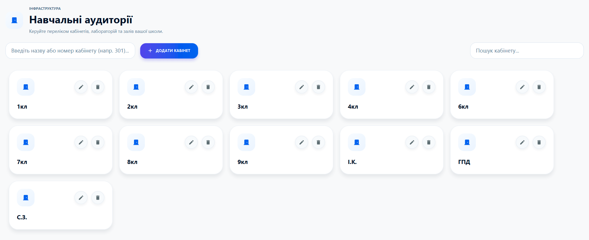

# 🏫 База школи: Структура та персонал

Щоб система працювала як годинник, необхідно один раз наповнити її базовими даними. Це фундамент для розкладу, замін та ефіру.

---

### 👤 Викладацький склад
Ведіть облік вчителів та їхньої спеціалізації:
*   **Додавання:** Просто введіть ПІБ та натисніть "Додати".
*   **Призначення предметів:** Оберіть дисципліну зі списку, щоб система знала, хто і що викладає. Це критично важливо для коректного відображення замін.

---

### 📚 Предмети
Створіть перелік усіх дисциплін, що викладаються у вашій школі.
*   **Систематизація:** Маючи список предметів, ви зможете заповнювати розклад за лічені хвилини, просто вибираючи потрібний варіант.

---

### 👥 Шкільні класи
Додайте всі класи вашого закладу.
*   **Пошук:** Якщо у вас велика школа, скористайтеся рядком пошуку, щоб швидко знайти потрібний клас та відредагувати його дані.

---

### 🚪 Навчальні аудиторії
Цифровий кабінет для кожного класу:
*   **Облік приміщень:** Вкажіть номери або назви кабінетів.
*   **Дисципліна:** Пов'язуйте аудиторії з уроками в розкладі, щоб учні завжди знали, куди йти, дивлячись на екран ефіру.

---

> **💡 Швидкий старт:** Не хочете вводити все вручну? Скористайтеся розділом **"Імпорт даних"**, щоб автоматично завантажити вчителів та класи з вашого електронного журналу!
