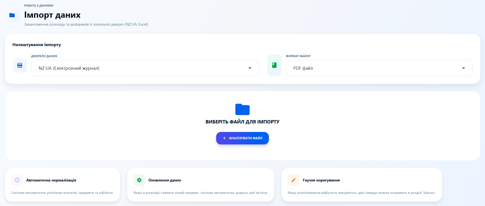
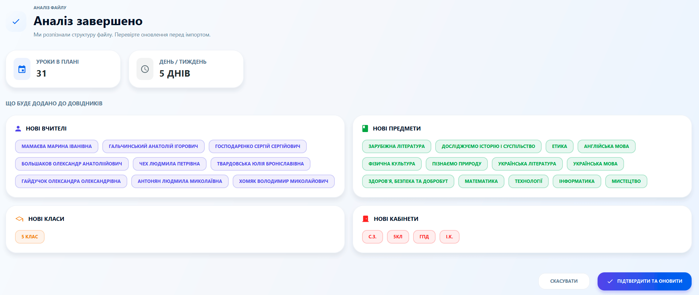

# 📥 Імпорт даних: Магія автоматизації

Ми цінуємо ваш час. Розділ "Імпорт даних" дозволяє перенести інформацію з електронних журналів до School Bell за лічені секунди. Більше ніякої монотонної ручної роботи!

---

### 🔮 Як працює інтелектуальний імпорт?
Система використовує спеціальний алгоритм для розпізнавання PDF-документів. Наразі найкраще підтримується платформа **NZ.UA (Нові Знання)**.

**Кроки для імпорту:**
1.  **Завантажте файл:** У вашому електронному журналі NZ.UA завантажте PDF-файл з розкладом класу на тиждень.
2.  **Аналіз:** У програмі School Bell натисніть кнопку **"Аналізувати файл"** та виберіть завантажений PDF.
3.  **Перевірка:** Система покаже вам вичитані дані (вчителів, предмети...). 
4.  **Підтвердження:** Натисніть **"Підтвердити та оновити"**, і ці дані миттєво з'являться в базі та розкладі програми.

---

### ✅ Результати та корекція
Після успішного імпорту система автоматично створить:
*   Картки вчителів.
*   Список предметів.
*   Навчальні аудиторії.
*   Класи.
*   Заповнений тижневий розклад для вибраного класу.

---

### ⚠️ Важливі зауваження
*   **Точність:** PDF — складний формат, тому інколи можливі неточності у розпізнаванні складних прізвищ чи назв предметів.
*   **Ручна правка:** Якщо ви помітили помилку вже після імпорту, ви можете легко виправити її в розділах **"Школа"** або **"Розклад"**.
