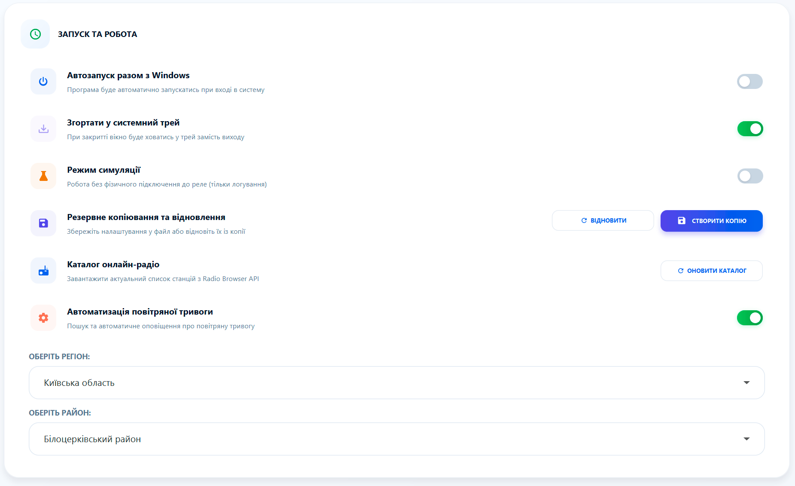
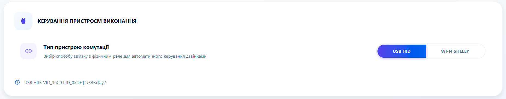
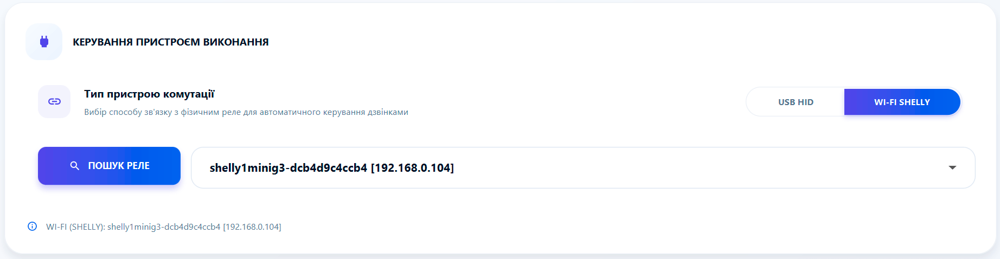
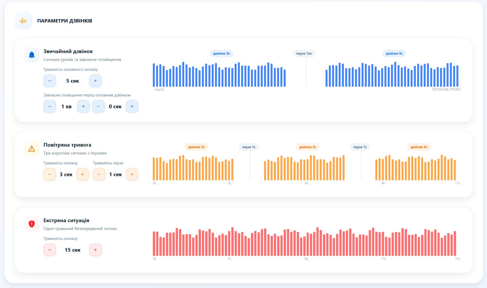
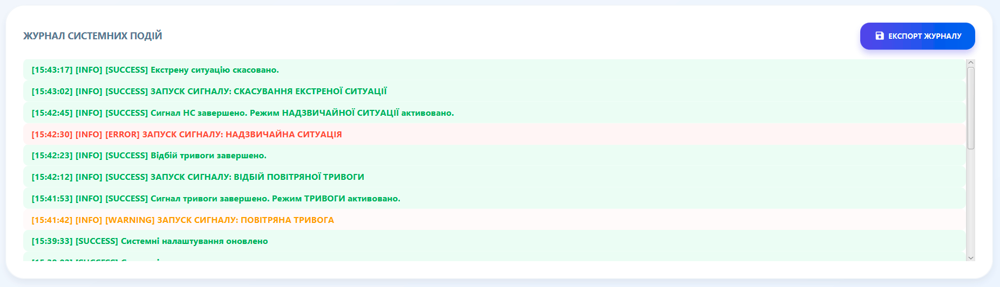

# ⚙️ Системні налаштування: Тонке підлаштування

Тут ви керуєте "мозком" системи. Налаштування дозволяють адаптувати програму під технічні особливості вашої школи.

---

### 🛠️ Запуск та надійність
*   **Режим симуляції:** Дозволяє тестувати систему без активації реального дзвінка. Корисно під час канікул або налаштування.
*   **Резервне копіювання:** Створюйте "точки відновлення" вашої бази. Якщо ви зміните комп'ютер, ви зможете відновити всі дані за один клік.
*   **Каталог радіо:** Оновлюйте список станцій одним натисканням, щоб завжди мати доступ до актуальних ефірів.
*   **Перевірка оновлень:** Кнопка для ручної перевірки наявності нової версії програми. Корисно, якщо ви пропустили автоматичне сповіщення при запускку.

---

### 🚨 Автоматизація повітряної тривоги
Найважливіша функція для безпеки в сучасних умовах. 
*   **Регіональність:** Виберіть свою область та район.
*   **Інтелектуальний моніторинг:** Програма автоматично перевіряє офіційні джерела кожні декілька секунд.
*   **Автоматична реакція:** При оголошенні тривоги система сама ввімкне дзвінок та відповідне аудіосповіщення.

> **⚠️ Увага:** Функція залежить від стабільності інтернету. У разі втрати зв'язку програма подасть сигнал **"Помилка автоматизації"**, щоб персонал знав про необхідність ручного контролю.

---

### 🔌 Керування обладнанням (Реле)
School Bell підтримує два типи фізичних підключень:
1.  **USB Реле:** Найпростіший варіант "включив і працює".
2.  **WiFi Shelly:** Сучасне безпровідне рішення.

**Налаштування Shelly:**
*   Натисніть **"Пошук"**, і програма сама знайде всі пристрої Shelly у вашій мережі.
*   Виберіть потрібне реле зі списку.
*   **Порада:** Встановіть статичну IP-адресу для Shelly у налаштуваннях вашого роутера.

---

### 🔔 Параметри сигналу дзвінка
Визначте характер вашого дзвінка:
*   **Тривалість:** Скільки секунд має лунати сигнал на урок та на перерву.
*   **Паузи:** Налаштуйте переривчастий сигнал, якщо це передбачено вашим обладнанням.
*   **Завчасний сигнал:** Спеціальний короткий дзвінок за 1-2 хвилини до основного, щоб учні встигли підготуватися.

---

### 📜 Журнал подій та діагностика
Програма веде детальний лог усіх дій за останні 7 днів.
*   **Прозорість:** Ви можете перевірити, хто і коли змінював налаштування або в який час точно спрацював екстрений сигнал.
*   **Експорт:** Якщо у вас виникли технічні труднощі, ви можете завантажити журнал та надіслати його службі підтримки для швидкого вирішення проблеми.

