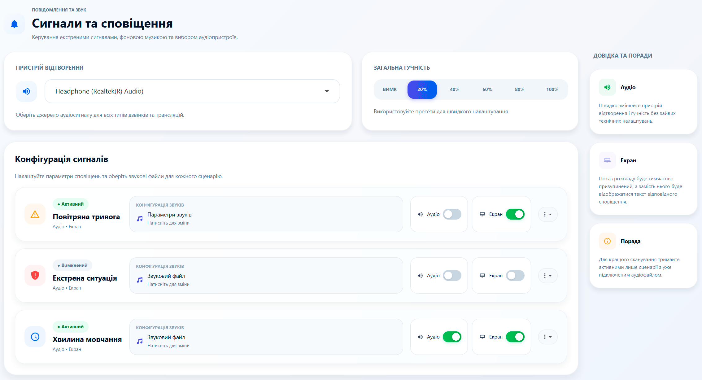
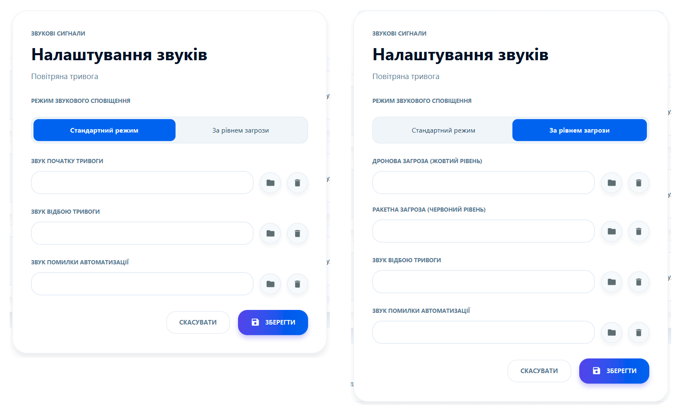
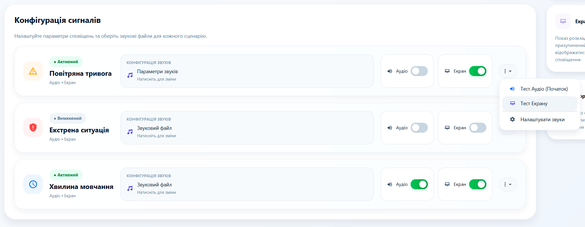
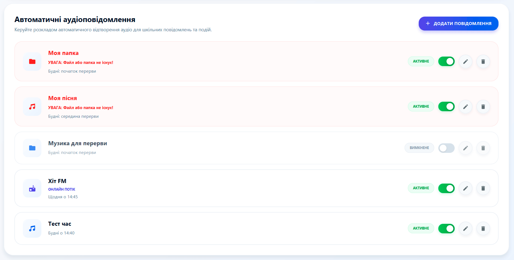
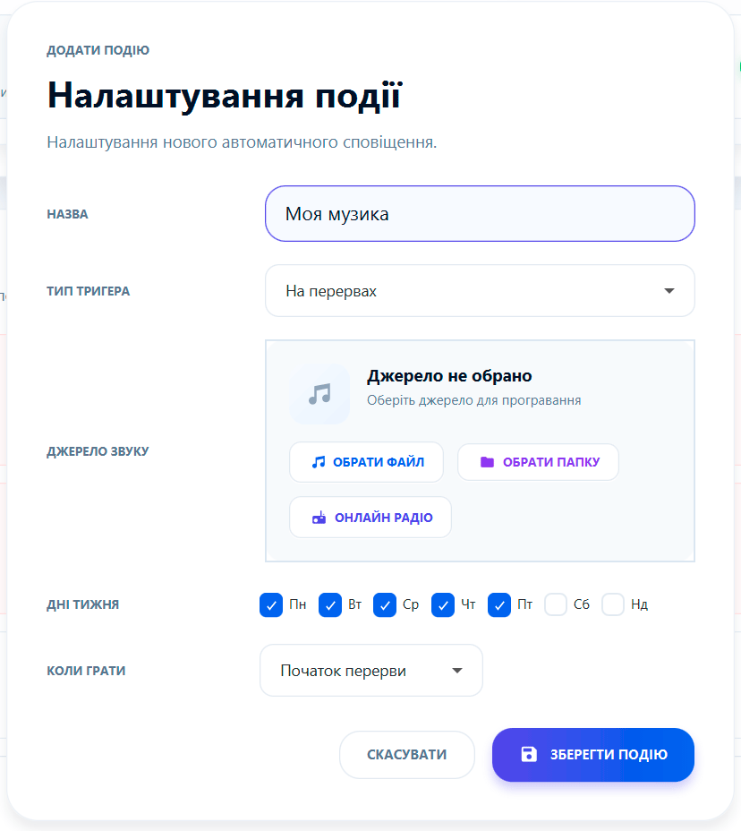
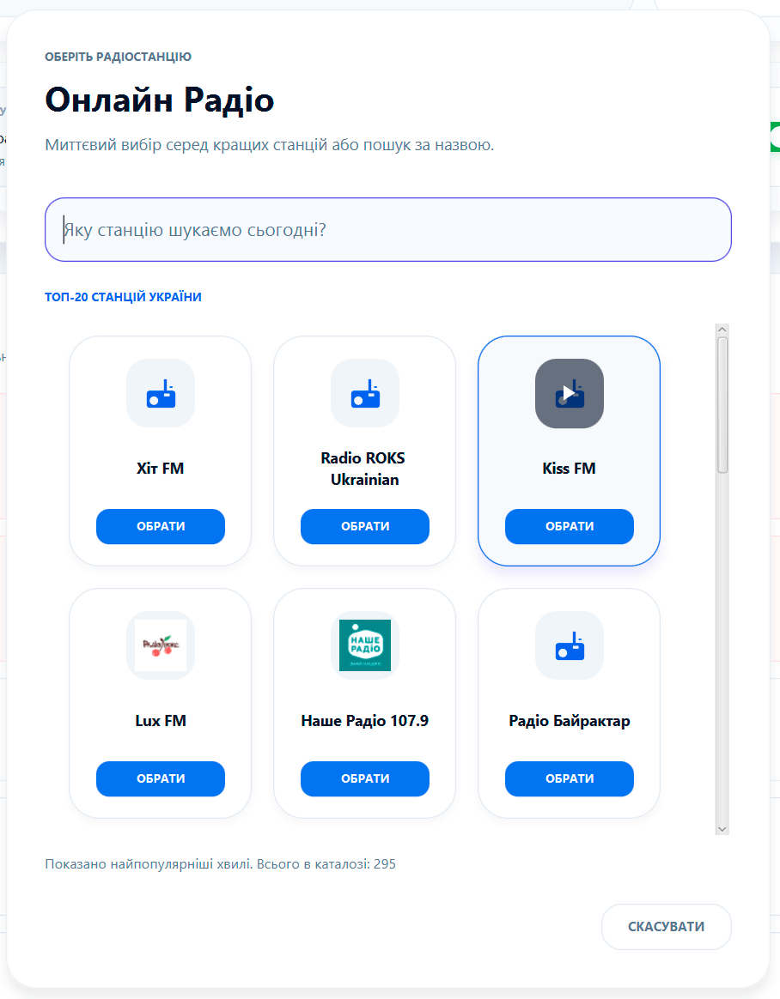

# 📣 Сигнали та сповіщення: Голос вашої школи

Перетворіть звичайний шкільний дзвінок на сучасну аудіосистему. Цей розділ дозволяє керувати всім, що звучить у стінах закладу: від класичного сигналу до онлайн-радіо.

---

### 🎧 Аудіоналаштування
Перш за все, переконайтеся, що система бачить ваші динаміки:
*   **Вибір пристрою:** Виберіть потрібний аудіовихід (наприклад, "Realtek High Definition Audio" або зовнішню USB-карту).
*   **Майстер-гучність:** Швидкі кнопки для перевірки та встановлення комфортного рівня звуку.

---

### 🛡️ Критичні сигнали
Налаштуйте особливі звуки для важливих подій. Програма підтримує:
*   **Повітряна тривога:** Спеціальний звук, що рятує життя.
*   **Надзвичайна ситуація:** Чіткий сигнал для евакуації.
*   **Хвилина мовчання (09:00):** Автоматичне вшанування пам'яті героїв.

**💡 Мультимедійність:** Ви можете не лише подати звук, а й автоматично вивести візуальне попередження на всі ТВ-екрани школи.

---

### 🎵 Автоматичний медіаефір
Створіть унікальну атмосферу на перервах та під час шкільних подій!
*   **Різноманітні джерела:** Використовуйте окремі файли (`.mp3`, `.wav`), цілі папки з музикою (з автоматичним перемішуванням треків) або онлайн-радіо.
*   **Пріоритет дзвінка:** Програма автоматично плавно приглушує музику за 10 секунд до дзвінка на урок і ніколи не перебиває сигнал.
*   **Безпека:** Мовлення миттєво глушиться під час повітряної тривоги, надзвичайних ситуацій чи хвилини мовчання.

#### 🎛️ Режими запуску (Типи тригерів):
При додаванні аудіоподії ви можете обрати один із 5 гнучких тригерів під потрібний сценарій:
1.  **На перервах** — музика звучить під час перерв між уроками (на початку, у середині або зі зміщенням у хвилинах від дзвінка).
2.  **У конкретний час** — регулярний запуск у фіксований час доби (`ГГ:ХХ`) за вибраними днями тижня.
3.  **Разово** — одноразовий запуск у призначену календарну дату та час (свято, лінійка, педрада).
4.  **У проміжку часу** — надійний запуск фонової музики у діапазоні (наприклад, зустріч учнів `08:00-08:25`), навіть якщо комп'ютер увімкнули вже після початку проміжку.
5.  **Перед першим уроком** — динамічний старт, який автоматично прив'язується до часу першого уроку за діючим розкладом поточного дня.

> 📖 **Повний посібник із налаштувань:**  
> Детальний опис кожного поля, формул зміщення, секунд затримки та зведену таблицю налаштувань дивіться у [**Довіднику з тригерів медіаподій**](../references/МЕДІА_ТРИГЕРИ.md).

---

### 📻 Онлайн радіо
Інтегрований каталог дозволяє транслювати найкращі українські та світові радіостанції без зайвого обладнання.
*   **Пошук:** Знайдіть свою улюблену станцію за назвою.
*   **Каталог:** Використовується глобальна база Radio Browser API.
*   **Оновлення:** Якщо список порожній — натисніть "Оновити каталог" у системних налаштуваннях.

